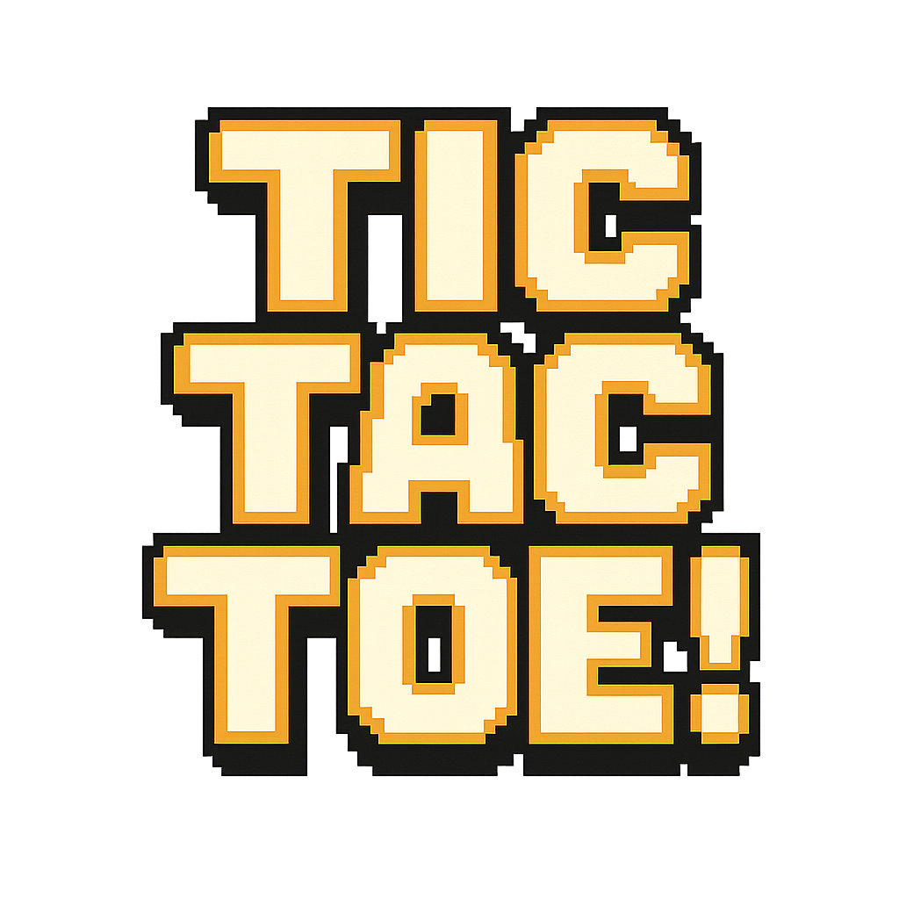

# Tic Tac Toe 8-Bits



Un jeu de morpion (tic-tac-toe) avec un style rétro 8-bits.

## Vidéo de présentation

[Voir la vidéo de présentation](Tic_tac_toc_8bits_presentation.mp4)

## Fonctionnalités

- Mode deux joueurs
- Mode un joueur avec IA (3 niveaux de difficulté)
- Musique de fond et effets sonores
- Interface 8-bits stylisée
- Support multilingue (français/anglais)

## Stratégies de l'IA

### Facile
L'IA choisit un coup aléatoire parmi les cases disponibles. Aucune stratégie particulière, idéal pour débuter.

### Moyen
L'IA suit une stratégie en deux étapes :
1. **Victoire** : Si l'IA peut gagner en un coup, elle prend ce coup
2. **Blocage** : Si l'adversaire peut gagner au prochain tour, l'IA bloque ce coup
3. **Aléatoire** : Sinon, elle joue aléatoirement

### Difficile
L'IA utilise l'algorithme **Minimax** pour analyser tous les coups possibles et choisir le meilleur. Elle ne peut jamais perdre et cherche toujours à gagner ou à faire match nul. C'est une IA invincible.

## Technologies

- Flutter
- BLoC pour la gestion d'état
- Auto Route pour la navigation
- Audio Players pour les sons

## Installation

```bash
flutter pub get
flutter run
```

## Tests

```bash
flutter test
```

